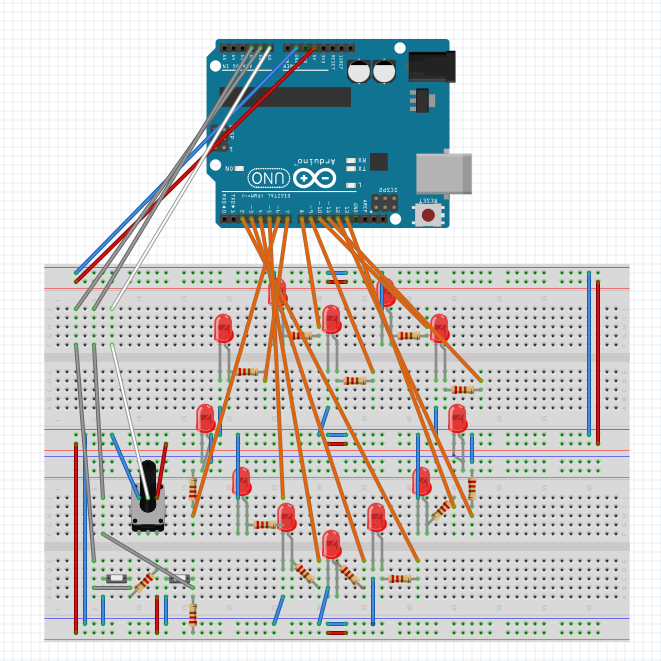

Heart LED
==========

2010-10403 노윤미 
2013-????? 김지현
 
## 1. 개요

이번 과제 2번은 포텐시오미터를 이용하여 LED 빛을 이동시키는 것이고, 3-a는 푸시버튼의 상승엣지검출을 통하여 7-segment display를 만드는 것이었다. 
여기에서 포텐시오미터 및 LED, 푸시버튼 상승엣지검출을 모두 사용하여 다른 과제를 해도 좋다는 허락을 받아 다른 과제를 기획하였다. 

## 2. 기능

Heart LED는 LED를 하트 모양으로 배치하여 점멸 방식 및 속도를 조절할 수 있다.
이때 점멸 방식은 푸시 버튼을 통한 모드 전환으로 변경이 가능하며, 속도는 포텐시오미터 조작으로 조정할 수 있다.

1. **모드**

    모드는 총 네 가지가 있다.
    1번 모드는 LED가 하나씩 회전하며 점멸한다.
    2번 모드에서는 두근거리는 듯이 전체 LED가 점멸한다.
    3번 모드는 모든 LED가 켜지고, 4번에서는 모든 LED의 빛이 꺼진다.
    이때 1, 2번 점멸 주기는 포텐시오미터를 통해 조절할 수 있다.

    한편, 모드의 전환은 스위치 버튼을 통해서 할 수 있다. 
    왼쪽 버튼은 이전 모드로, 오른쪽 버튼은 다음 모드로 이동한다.
    1번 모드일 때 왼쪽 버튼을 누르면 4번 모드로 전환, 4번 모드일 때 오른쪽 버튼을 누르면 1번 모드로 전환된다.

1. **점멸 주기**

    1, 2번 모드일 때 점멸 주기를 변경하기 위하여 포텐시오미터를 사용할 수 있다. 
    1번 모드에서 포텐시오미터를 오른쪽으로 돌리면 회전이 더 빨라지고, 왼쪽으로 돌리면 회전이 더 느려진다. 
    한편 2번 모드에서 포텐시오미터를 오른쪽으로 돌리면 더 빨리 점멸되고, 왼쪽으로 돌리면 점멸이 느려진다.

## 3. 회로

회로의 구성은 위와 같다.
이때 회로도의 bread board에서는 가로로 된 전원선이 모두 연결되어 있는 것으로 보이지만, 실제 bread board에서는 가운데가 끊어져 있다.
이 회로도에서는 가운데 부분이 끊어진 것으로 간주한다.

